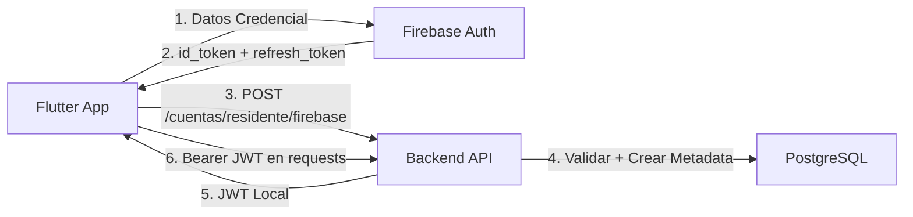

# 📱 API DOCUMENTACIÓN COMPLETA - Backend Residencias

## Versión: 1.0.0
**Última actualización:** 2024  
**Plataforma destino:** Flutter/Mobile  
**Servidor:** FastAPI  
**Base de datos:** PostgreSQL  

---

## 📋 Tabla de Contenidos

1. [Introducción y Conceptos](#introducción-y-conceptos)
2. [Configuración Base](#configuración-base)
3. [Autenticación](#autenticación)
4. [Endpoints - Cuentas (6)](#cuentas)
5. [Endpoints - QR (4)](#qr)
6. [Endpoints - Residentes (5)](#residentes)
7. [Endpoints - Propietarios (4)](#propietarios)
8. [Endpoints - Miembros de Familia (5)](#miembros-de-familia)
9. [Modelos de Datos (Schemas)](#modelos-de-datos)
10. [Códigos de Error](#códigos-de-error)
11. [Patrones de Implementación](#patrones-de-implementación)
12. [Ejemplos de Uso en Flutter](#ejemplos-de-uso-en-flutter)

---

## Introducción y Conceptos

### Visión General

Este proyecto es un **sistema de control de acceso y gestión de residencias** con las siguientes características:

- **Usuarios:** Propietarios, Residentes, Miembros de Familia
- **Autenticación:** Firebase Authentication + JWT local
- **Control de Acceso:** Códigos QR con vigencia temporal
- **Gestión:** Personas, Viviendas, Relaciones Familiares
- **Auditoría:** Registro de todas las operaciones con usuario y fecha

### Conceptos Clave

| Concepto | Descripción |
|----------|-----------|
| **Persona** | Registro de una persona física (nombre, identificación, contacto) |
| **Vivienda** | Unidad residencial (identificada por manzana y villa) |
| **Propietario** | Persona que posee una vivienda |
| **Residente** | Persona que habita una vivienda (puede ser propietario o no) |
| **Miembro de Familia** | Persona relacionada a un residente (padre, madre, hijo, etc.) |
| **Cuenta** | Credencial de acceso (Firebase UID + metadatos locales) |
| **QR** | Código de acceso temporal (propio para residente o visita) |
| **Visita** | Registro de personas visitantes autorizadas |
| **Acceso** | Log de intentos de acceso (validación de QR, entrada manual) |

---

## Configuración Base

### URL Base del API

```
Producción:  https://api.residencias.com/api/v1
Desarrollo:  http://localhost:8000/api/v1
```

### Headers Requeridos

```http
Content-Type: application/json
Authorization: Bearer {access_token}  # Para endpoints protegidos
```

### Configuración en settings (config.py)

```python
# Paginación
PAGINATION_DEFAULT_PAGE = 1
PAGINATION_DEFAULT_PAGE_SIZE = 10
PAGINATION_MAX_PAGE_SIZE = 100

# Contraseñas
PASSWORD_MIN_LENGTH = 8
PASSWORD_MAX_BYTES = 72
PASSWORD_SPECIAL_CHARS = "!@#$%^&*()_+-=[]{}|;:,.<>?"
PASSWORD_MUST_HAVE_UPPER = True
PASSWORD_MUST_HAVE_DIGIT = True
PASSWORD_MUST_HAVE_SPECIAL = False

# QR
QR_TOKEN_LENGTH = 32
QR_CODE_VALIDITY_MINUTES = 3

# Biometría
MAX_BIOMETRIC_FAILED_ATTEMPTS = 2
PHONE_RESPONSE_TIMEOUT_SECONDS = 30

# Timezone
TIMEZONE = "America/Bogota"  # Configurable por ambiente

# Longitudes de campos
FIELD_LENGTHS = {
    'identification': 20,
    'phone': 15,
    'email': 100,
    'address': 120,
    'username': 50,
    'user_action': 20,
    'manzana': 10,
    'villa': 10,
}
```

---

## Autenticación

### Flujo de Autenticación: Firebase + JWT Local

#### Opción 1: Firebase Authentication



#### Step 1: Crear Cuenta en Firebase (Client Side - Flutter)

```json
// Firebase Auth (lado del cliente)
{
  "email": "usuario@example.com",
  "password": "SecurePass123!"
}
// Firebase devuelve: id_token, refresh_token, uid
```

#### Step 2: Crear Metadata Local

**POST** `/cuentas/residente/firebase`

```json
{
  "persona_id": 1,
  "firebase_uid": "xyz123firebase",
  "username": "usuario@example.com",
  "usuario_creado": "admin"
}
```

**Respuesta (201 Created):**
```json
{
  "id": 42,
  "firebase_uid": "xyz123firebase",
  "persona_id": 1,
  "nombres": "Juan Pérez",
  "mensaje": "Cuenta de residente creada exitosamente"
}
```

#### Step 3: Obtener JWT Local (Optional)

Si se requiere JWT local adicional para manejo de sesión:

```json
POST /auth/login
{
  "username": "usuario@example.com",
  "password": "SecurePass123!"
}
```

**Respuesta:**
```json
{
  "access_token": "eyJhbGciOiJIUzI1NiIsInR5cCI6IkpXVCJ9...",
  "token_type": "bearer",
  "usuario_id": 1,
  "username": "usuario@example.com"
}
```

---

## CUENTAS

**Prefijo:** `/api/v1/cuentas`  
**Total Endpoints:** 6

### 1. Crear Cuenta de Residente con Firebase

**Endpoint:** `POST /residente/firebase`  
**Requirement:** RF-C01  
**Auth:** No requiere (es el primer paso)

**Descripción:**
Crea una cuenta de residente después de que el usuario se haya registrado en Firebase. Vincula el Firebase UID con la persona registrada en la base de datos.

**Request Body:**
```json
{
  "persona_id": 1,
  "firebase_uid": "firebase_uid_del_usuario",
  "username": "usuario@example.com",
  "usuario_creado": "api_system"
}
```

**Validaciones:**
- ✅ Persona debe existir y estar activa
- ✅ Persona debe ser residente activo (debe existir en tabla ResidenteVivienda)
- ✅ No debe existir cuenta previa para esta persona
- ✅ Firebase UID debe ser único

**Success Response (201 Created):**
```json
{
  "id": 42,
  "firebase_uid": "firebase_uid_del_usuario",
  "persona_id": 1,
  "nombres": "Juan Pérez",
  "mensaje": "Cuenta de residente creada exitosamente"
}
```

**Error Responses:**
```json
// 404 - Residente no encontrado
{
  "detail": "Residente no encontrado o inactivo"
}

// 409 - Cuenta o Firebase UID duplicado
{
  "detail": "Cuenta ya existe para este residente"
}

// 400 - No es residente activo
{
  "detail": "Persona no es residente activo"
}
```

**Ejemplo en Dart/Flutter:**
```dart
Future<void> crearCuentaResidente() async {
  final response = await http.post(
    Uri.parse('$baseUrl/cuentas/residente/firebase'),
    headers: {'Content-Type': 'application/json'},
    body: jsonEncode({
      'persona_id': 1,
      'firebase_uid': firebaseUser.uid,
      'username': firebaseUser.email,
      'usuario_creado': 'flutter_app'
    }),
  );
  
  if (response.statusCode == 201) {
    print('Cuenta creada: ${response.body}');
  } else {
    throw Exception('Error: ${response.body}');
  }
}
```

---

### 2. Crear Cuenta de Miembro de Familia con Firebase

**Endpoint:** `POST /miembro/firebase`  
**Requirement:** RF-C02  
**Auth:** No requiere

**Descripción:**
Similar a residente pero para miembros de familia. Valida que la persona sea miembro de familia activo.

**Request Body:**
```json
{
  "persona_id": 5,
  "firebase_uid": "firebase_uid_miembro",
  "username": "miembro@example.com",
  "usuario_creado": "api_system"
}
```

**Validaciones:**
- ✅ Persona debe existir y estar activa
- ✅ Persona debe ser miembro de familia activo (tabla MiembroVivienda)
- ✅ No debe existir cuenta previa
- ✅ Firebase UID debe ser único

**Success Response (201 Created):**
```json
{
  "id": 43,
  "firebase_uid": "firebase_uid_miembro",
  "persona_id": 5,
  "nombres": "María Pérez",
  "mensaje": "Cuenta de miembro creada exitosamente"
}
```

---

### 3. Bloquear Cuenta

**Endpoint:** `POST /{cuenta_id}/bloquear`  
**Requirement:** RF-C08  
**Auth:** Bearer token (admin/seguridad)

**Descripción:**
Bloquea una cuenta existente. El usuario bloqueado no puede acceder.

**Request Body:**
```json
{
  "motivo": "Violación de políticas de acceso",
  "usuario_actualizado": "admin_001"
}
```

**Success Response (200 OK):**
```json
{
  "mensaje": "Cuenta bloqueada correctamente",
  "cuenta_id": 42,
  "motivo": "Violación de políticas de acceso"
}
```

**Validaciones:**
- ✅ Cuenta debe existir
- ✅ Motivo es requerido

**Error Response:**
```json
{
  "detail": "Cuenta no encontrada"
}
```

---

### 4. Desbloquear Cuenta

**Endpoint:** `POST /{cuenta_id}/desbloquear`  
**Requirement:** RF-C09  
**Auth:** Bearer token (admin)

**Descripción:**
Desbloquea una cuenta previamente bloqueada.

**Request Body:**
```json
{
  "motivo": "Apelación aprobada",
  "usuario_actualizado": "admin_001"
}
```

**Success Response (200 OK):**
```json
{
  "mensaje": "Cuenta desbloqueada correctamente",
  "cuenta_id": 42
}
```

---

### 5. Eliminar Cuenta

**Endpoint:** `DELETE /{cuenta_id}`  
**Auth:** Bearer token (admin)

**Descripción:**
Elimina (soft delete) una cuenta del sistema.

**Request Body:**
```json
{
  "motivo": "Solicitud de eliminación de datos",
  "usuario_actualizado": "admin_001"
}
```

**Success Response (200 OK):**
```json
{
  "mensaje": "Cuenta eliminada correctamente",
  "cuenta_id": 42
}
```

---

### 6. Obtener Perfil de Usuario (por Firebase UID)

**Endpoint:** `GET /perfil/{firebase_uid}`  
**Requirement:** RF-C03 (Nueva funcionalidad)  
**Auth:** No requiere

**Descripción:**
Obtiene la información completa del perfil de un usuario basado en su Firebase UID. Retorna toda la información necesaria para la app incluyendo rol, vivienda, y parentesco si aplica.

**Path Parameters:**
```
{firebase_uid} = UID obtenido de Firebase Auth
```

**Success Response (200 OK):**
```json
{
  "persona_id": 1,
  "identificacion": "1234567890",
  "nombres": "Juan",
  "apellidos": "Pérez López",
  "correo": "juan.perez@example.com",
  "celular": "+593987654321",
  "estado": "activo",
  "rol": "residente",
  "vivienda": {
    "manzana": "A",
    "villa": "101"
  },
  "parentesco": null,
  "fecha_creado": "2024-12-20T10:00:00"
}
```

**Response Fields:**
| Campo | Tipo | Descripción |
|-------|------|-----------|
| persona_id | integer | ID de la persona en BD |
| identificacion | string | Cédula/Pasaporte |
| nombres | string | Nombres |
| apellidos | string | Apellidos |
| correo | string\|null | Email |
| celular | string\|null | Teléfono |
| estado | string | "activo" o "inactivo" |
| rol | string | "residente" o "miembro_familia" |
| vivienda.manzana | string | Manzana de la residencia |
| vivienda.villa | string | Villa de la residencia |
| parentesco | string\|null | Solo si rol="miembro_familia" (padre, madre, hijo, etc.) |
| fecha_creado | datetime | Fecha de registro del usuario |

**Ejemplo de Respuesta - Miembro de Familia:**
```json
{
  "persona_id": 4,
  "identificacion": "2222222222",
  "nombres": "Ana",
  "apellidos": "Pérez García",
  "correo": "ana.perez@example.com",
  "celular": "+593987777777",
  "estado": "activo",
  "rol": "miembro_familia",
  "vivienda": {
    "manzana": "A",
    "villa": "101"
  },
  "parentesco": "hija",
  "fecha_creado": "2024-12-24T10:00:00"
}
```

**Validaciones:**
- ✅ Firebase UID debe existir
- ✅ Cuenta debe estar activa (no eliminada ni bloqueada)
- ✅ Persona debe ser residente O miembro de familia activo
- ✅ Usuario debe tener una vivienda asignada

**Error Responses:**

```json
// 404 - Firebase UID no encontrado
{
  "detail": "Cuenta no encontrada"
}

// 404 - No es residente ni miembro
{
  "detail": "Usuario no es residente ni miembro de familia activo"
}
```

**Uso en Flutter:**

```dart
Future<PerfilUsuario> obtenerMiPerfil(String firebaseUid) async {
  final response = await http.get(
    Uri.parse('$baseUrl/cuentas/perfil/$firebaseUid'),
    headers: {'Content-Type': 'application/json'},
  );
  
  if (response.statusCode == 200) {
    final data = jsonDecode(response.body);
    return PerfilUsuario.fromJson(data);
  } else if (response.statusCode == 404) {
    throw Exception('Usuario no encontrado');
  } else {
    throw Exception('Error: ${response.body}');
  }
}

// Ejemplo de modelo Dart
class PerfilUsuario {
  final int personaId;
  final String identificacion;
  final String nombres;
  final String apellidos;
  final String? correo;
  final String? celular;
  final String estado;
  final String rol; // "residente" o "miembro_familia"
  final ViviendaInfo vivienda;
  final String? parentesco;
  final DateTime fechaCreado;
  
  PerfilUsuario({
    required this.personaId,
    required this.identificacion,
    required this.nombres,
    required this.apellidos,
    this.correo,
    this.celular,
    required this.estado,
    required this.rol,
    required this.vivienda,
    this.parentesco,
    required this.fechaCreado,
  });
  
  factory PerfilUsuario.fromJson(Map<String, dynamic> json) {
    return PerfilUsuario(
      personaId: json['persona_id'],
      identificacion: json['identificacion'],
      nombres: json['nombres'],
      apellidos: json['apellidos'],
      correo: json['correo'],
      celular: json['celular'],
      estado: json['estado'],
      rol: json['rol'],
      vivienda: ViviendaInfo.fromJson(json['vivienda']),
      parentesco: json['parentesco'],
      fechaCreado: DateTime.parse(json['fecha_creado']),
    );
  }
}

class ViviendaInfo {
  final String manzana;
  final String villa;
  
  ViviendaInfo({required this.manzana, required this.villa});
  
  factory ViviendaInfo.fromJson(Map<String, dynamic> json) {
    return ViviendaInfo(
      manzana: json['manzana'],
      villa: json['villa'],
    );
  }
}

// Uso en la app
void cargarPerfilUsuario() async {
  final user = FirebaseAuth.instance.currentUser;
  if (user != null) {
    try {
      final perfil = await obtenerMiPerfil(user.uid);
      print('Nombre: ${perfil.nombres}');
      print('Rol: ${perfil.rol}');
      print('Vivienda: ${perfil.vivienda.manzana}-${perfil.vivienda.villa}');
      
      // Habilitar funciones según rol
      if (perfil.rol == 'residente') {
        mostrarOpcionesResidente();
      } else if (perfil.rol == 'miembro_familia') {
        mostrarOpcionesMiembro(perfil.parentesco);
      }
    } catch (e) {
      print('Error: $e');
    }
  }
}
```

**Casos de Uso:**

1. **Obtener datos al iniciar sesión:**
   ```dart
   // Después de que Firebase Auth retorna el UID
   final perfil = await obtenerMiPerfil(firebaseUser.uid);
   // Guardar en SharedPreferences o Provider
   await guardarPerfilLocal(perfil);
   ```

2. **Habilitar/Deshabilitar opciones según rol:**
   ```dart
   if (perfil.rol == 'residente') {
     // Mostrar: Generar QR propio, gestionar familia
     habilitarOpcionesResidente();
   } else if (perfil.rol == 'miembro_familia') {
     // Mostrar: Generar QR propio (limitado)
     // Parentesco importante para algunos flujos
     habilitarOpcionesMiembro(perfil.parentesco);
   }
   ```

3. **Mostrar información de vivienda:**
   ```dart
   final direccion = 'Manzana ${perfil.vivienda.manzana}, Villa ${perfil.vivienda.villa}';
   mostrarInformacionVivienda(direccion);
   ```

---

## QR

**Prefijo:** `/api/v1/qr`  
**Total Endpoints:** 4

### 1. Generar QR Propio

**Endpoint:** `POST /generar-propio`  
**Requirement:** RF-Q01  
**Auth:** Bearer token (usuario autenticado)

**Descripción:**
Genera un código QR temporal para que el residente pueda acceder a la vivienda en un horario específico. Se usa para auto-acceso.

**Request Body:**
```json
{
  "duracion_horas": 8,
  "fecha_acceso": "2024-12-25",
  "hora_inicio": "14:30",
  "usuario_creado": "flutter_app"
}
```

**Parameters:**
| Campo | Tipo | Validación | Descripción |
|-------|------|-----------|-----------|
| duracion_horas | integer | > 0 | Horas de vigencia del QR |
| fecha_acceso | date | YYYY-MM-DD, >= hoy | Fecha de acceso |
| hora_inicio | string | HH:MM formato | Hora de inicio |
| usuario_creado | string | requerido | Usuario que genera (tracking) |

**Success Response (201 Created):**
```json
{
  "id": 15,
  "token": "aB3cDeFgHiJkLmNoPqRsTuVwXyZ123456",
  "hora_inicio": "2024-12-25T14:30:00",
  "hora_fin": "2024-12-25T22:30:00",
  "estado": "vigente",
  "mensaje": "Código QR generado correctamente"
}
```

**Validaciones:**
- ✅ Usuario debe tener cuenta activa
- ✅ Usuario debe ser residente activo
- ✅ Fecha y hora deben ser futuras (comparadas con servidor)
- ✅ Duración debe ser > 0 horas
- ✅ Usuario debe tener vivienda asignada

**Error Responses:**
```json
// 403 - No autorizado
{
  "detail": "Usuario no autorizado para generar QR"
}

// 400 - Datos inválidos
{
  "detail": "La fecha y hora deben ser futuras"
}

// 400 - Sin vivienda
{
  "detail": "Usuario no tiene una vivienda asignada como residente activo"
}
```

**Ejemplo en Dart/Flutter:**
```dart
Future<Map<String, dynamic>> generarQRPropio(
  int duracionHoras,
  DateTime fecha,
  TimeOfDay hora,
) async {
  final response = await http.post(
    Uri.parse('$baseUrl/qr/generar-propio'),
    headers: {
      'Content-Type': 'application/json',
      'Authorization': 'Bearer $accessToken',
    },
    body: jsonEncode({
      'duracion_horas': duracionHoras,
      'fecha_acceso': DateFormat('yyyy-MM-dd').format(fecha),
      'hora_inicio': '${hora.hour.toString().padLeft(2, '0')}:${hora.minute.toString().padLeft(2, '0')}',
      'usuario_creado': 'flutter_app'
    }),
  );

  if (response.statusCode == 201) {
    return jsonDecode(response.body);
  } else {
    throw Exception('Error: ${response.body}');
  }
}
```

---

### 2. Generar QR Visita

**Endpoint:** `POST /generar-visita`  
**Requirement:** RF-Q02  
**Auth:** Bearer token

**Descripción:**
Genera un código QR para una visita. Registra automáticamente los datos del visitante en la tabla `visita`.

**Request Body:**
```json
{
  "visita_identificacion": "1234567890",
  "visita_nombres": "Carlos",
  "visita_apellidos": "García",
  "motivo_visita": "Revisión técnica de aire acondicionado",
  "duracion_horas": 2,
  "fecha_acceso": "2024-12-25",
  "hora_inicio": "10:00",
  "usuario_creado": "flutter_app"
}
```

**Parameters:**
| Campo | Tipo | Validación | Descripción |
|-------|------|-----------|-----------|
| visita_identificacion | string | requerido, max 20 | Cédula/Pasaporte visitante |
| visita_nombres | string | requerido | Nombres del visitante |
| visita_apellidos | string | requerido | Apellidos del visitante |
| motivo_visita | string | requerido | Razón de la visita |
| duracion_horas | integer | > 0 | Horas de vigencia |
| fecha_acceso | date | futuro | Fecha de acceso |
| hora_inicio | string | HH:MM | Hora de inicio |
| usuario_creado | string | requerido | Sistema que genera |

**Success Response (201 Created):**
```json
{
  "id": 16,
  "token": "xY9aBcDeFgHiJkLmNoPqRsTuVwXyZ789",
  "visitante": "Carlos García",
  "motivo": "Revisión técnica de aire acondicionado",
  "hora_inicio": "2024-12-25T10:00:00",
  "hora_fin": "2024-12-25T12:00:00",
  "estado": "vigente",
  "visita_id": 101,
  "mensaje": "QR de visita generado correctamente"
}
```

**Validaciones:**
- ✅ Usuario debe tener cuenta activa
- ✅ Datos de visitante son obligatorios
- ✅ Fecha/hora deben ser futuras
- ✅ Identificación visitante <= 20 caracteres

**Side Effects:**
- Se registra automáticamente en tabla `visita`
- Se crea entrada de auditoría

**Error Responses:**
```json
{
  "detail": "Los datos de la visita son obligatorios"
}
```

---

### 3. Obtener Detalles de QR

**Endpoint:** `GET /{qr_id}`  
**Requirement:** Información / Verificación  
**Auth:** Bearer token

**Descripción:**
Obtiene los detalles completos de un código QR específico.

**Path Parameters:**
```
{qr_id} = ID del QR (integer)
```

**Success Response (200 OK):**
```json
{
  "id": 15,
  "token": "aB3cDeFgHiJkLmNoPqRsTuVwXyZ123456",
  "hora_inicio_vigencia": "2024-12-25T14:30:00",
  "hora_fin_vigencia": "2024-12-25T22:30:00",
  "estado": "vigente",
  "fecha_creado": "2024-12-24T09:15:00"
}
```

**Error Response:**
```json
{
  "detail": "QR no encontrado"
}
```

---

### 4. Listar QRs Generados (Paginado y Filtrable)

**Endpoint:** `GET /cuenta/generados`  
**Requirement:** RF-Q03  
**Auth:** Bearer token

**Descripción:**
Lista todos los QRs generados por una cuenta con soporte para paginación y filtrado por tipo (propio, visita o todos).

**Query Parameters:**
```
?page=1
&page_size=10
&tipo_ingreso=all  # Valores: "propio", "visita", "all"
```

| Parámetro | Tipo | Default | Validación |
|-----------|------|---------|-----------|
| page | integer | 1 | >= 1 |
| page_size | integer | 10 | 1-100 |
| tipo_ingreso | string | "all" | "propio", "visita", "all" |

**Success Response (200 OK):**
```json
{
  "data": [
    {
      "qr_pk": 15,
      "token": "aB3cDeFgHiJkLmNoPqRsTuVwXyZ123456",
      "estado": "vigente",
      "tipo_ingreso": "propio",
      "hora_inicio_vigencia": "2024-12-25T14:30:00",
      "hora_fin_vigencia": "2024-12-25T22:30:00",
      "fecha_creado": "2024-12-24T09:15:00"
    },
    {
      "qr_pk": 16,
      "token": "xY9aBcDeFgHiJkLmNoPqRsTuVwXyZ789",
      "estado": "vigente",
      "tipo_ingreso": "visita",
      "hora_inicio_vigencia": "2024-12-25T10:00:00",
      "hora_fin_vigencia": "2024-12-25T12:00:00",
      "fecha_creado": "2024-12-24T08:00:00"
    }
  ],
  "total": 2,
  "page": 1,
  "page_size": 10,
  "total_pages": 1,
  "has_next": false
}
```

**Paginación:**
- El campo `has_next` indica si hay más páginas
- `total_pages` = ceil(total / page_size)
- Para mobile: use `has_next` para mostrar botón "Cargar más"

**Filtrado por tipo_ingreso:**

```
GET /cuenta/generados?tipo_ingreso=propio
GET /cuenta/generados?tipo_ingreso=visita
GET /cuenta/generados?tipo_ingreso=all
GET /cuenta/generados?page=2&page_size=20&tipo_ingreso=propio
```

**Error Response:**
```json
{
  "detail": "Usuario no autorizado"
}
```

**Ejemplo en Dart/Flutter:**
```dart
Future<Map<String, dynamic>> listarQRs({
  int page = 1,
  int pageSize = 10,
  String tipoIngreso = 'all',
}) async {
  final queryParams = {
    'page': page.toString(),
    'page_size': pageSize.toString(),
    'tipo_ingreso': tipoIngreso,
  };

  final response = await http.get(
    Uri.parse('$baseUrl/qr/cuenta/generados')
        .replace(queryParameters: queryParams),
    headers: {
      'Authorization': 'Bearer $accessToken',
    },
  );

  if (response.statusCode == 200) {
    return jsonDecode(response.body);
  } else {
    throw Exception('Error: ${response.body}');
  }
}

// Uso
final qrs = await listarQRs(page: 1, tipoIngreso: 'propio');
print('Total QRs: ${qrs['total']}');
print('Hay más: ${qrs['has_next']}');
```

---

## RESIDENTES

**Prefijo:** `/api/v1/residentes`  
**Total Endpoints:** 5

### 1. Registrar Residente

**Endpoint:** `POST /`  
**Requirement:** RF-R01  
**Auth:** Bearer token (admin/propietario)

**Descripción:**
Registra una nueva persona como residente en una vivienda.

**Request Body:**
```json
{
  "identificacion": "1234567890",
  "tipo_identificacion": "cedula",
  "nombres": "Juan",
  "apellidos": "Pérez López",
  "fecha_nacimiento": "1990-05-15",
  "nacionalidad": "Ecuador",
  "correo": "juan.perez@example.com",
  "celular": "+593987654321",
  "direccion_alternativa": "Calle 5 # 123",
  "vivienda_id": 1,
  "doc_autorizacion_pdf": "https://storage.com/doc.pdf",
  "usuario_creado": "admin_001"
}
```

**Validaciones:**
- ✅ Vivienda debe existir y estar activa
- ✅ Identificación debe ser única (no puede existir persona activa con mismo documento)
- ✅ Email debe ser válido (formato)
- ✅ Teléfono <= 15 caracteres
- ✅ Identificación <= 20 caracteres

**Success Response (201 Created):**
```json
{
  "id": 10,
  "persona_id": 1,
  "mensaje": "Residente registrado correctamente"
}
```

**Error Responses:**
```json
// 404 - Vivienda no existe
{
  "detail": "Vivienda no encontrada o inactiva"
}

// 409 - Identificación duplicada
{
  "detail": "El identificación ya está registrada"
}
```

---

### 2. Desactivar Residente

**Endpoint:** `POST /{residente_id}/desactivar`  
**Requirement:** RF-R05  
**Auth:** Bearer token (admin/propietario)

**Descripción:**
Desactiva un residente (cambiar estado a "inactivo"). El residente no puede acceder ni generar QRs.

**Path Parameters:**
```
{residente_id} = ID de registro en tabla ResidenteVivienda
```

**Request Body:**
```json
{
  "motivo": "Cambio de domicilio",
  "usuario_actualizado": "admin_001"
}
```

**Success Response (200 OK):**
```json
{
  "mensaje": "Residente desactivado correctamente",
  "residente_id": 10
}
```

**Validaciones:**
- ✅ Residente debe existir
- ✅ No puede estar ya inactivo

**Error Responses:**
```json
{
  "detail": "El residente ya se encuentra inactivo"
}
```

**TODO Pendiente:**
- Desactivar automáticamente miembros de familia asociados

---

### 3. Reactivar Residente

**Endpoint:** `POST /{residente_id}/reactivar`  
**Requirement:** Reversión de desactivación  
**Auth:** Bearer token (admin)

**Descripción:**
Reactiva un residente previamente desactivado.

**Request Body:**
```json
{
  "motivo": "Retorno a domicilio anterior",
  "usuario_actualizado": "admin_001"
}
```

**Success Response (200 OK):**
```json
{
  "mensaje": "Residente reactivado correctamente",
  "residente_id": 10
}
```

---

### 4. Subir Foto de Residente

**Endpoint:** `POST /{persona_id}/foto`  
**Requirement:** RF-R03  
**Auth:** Bearer token

**Descripción:**
Sube/registra una foto de rostro de un residente para identificación biométrica.

**Request Body:**
```json
{
  "ruta_imagen": "https://storage.com/fotos/juan_perez_1.jpg",
  "formato": "jpg",
  "usuario_creado": "flutter_app"
}
```

**Success Response (201 Created):**
```json
{
  "id": 50,
  "persona_id": 1,
  "ruta_imagen": "https://storage.com/fotos/juan_perez_1.jpg",
  "mensaje": "Foto registrada correctamente"
}
```

---

### 5. Listar Fotos de Residente

**Endpoint:** `GET /{persona_id}/fotos`  
**Auth:** Bearer token

**Descripción:**
Lista todas las fotos de rostro registradas para un residente.

**Query Parameters (Optional):**
```
?incluir_eliminadas=false  # Incluir fotos marcadas como eliminadas
```

**Success Response (200 OK):**
```json
{
  "persona_id": 1,
  "fotos": [
    {
      "id": 50,
      "ruta_imagen": "https://storage.com/fotos/juan_perez_1.jpg",
      "formato": "jpg",
      "fecha_creado": "2024-12-24T10:30:00",
      "usuario_creado": "flutter_app"
    },
    {
      "id": 51,
      "ruta_imagen": "https://storage.com/fotos/juan_perez_2.jpg",
      "formato": "jpg",
      "fecha_creado": "2024-12-24T11:00:00",
      "usuario_creado": "flutter_app"
    }
  ],
  "total": 2
}
```

---

## PROPIETARIOS

**Prefijo:** `/api/v1/propietarios`  
**Total Endpoints:** 4

### 1. Registrar Propietario

**Endpoint:** `POST /`  
**Requirement:** RF-P01  
**Auth:** Bearer token (admin)

**Descripción:**
Registra un nuevo propietario y lo asigna a una vivienda. El propietario se registra automáticamente como residente.

**Request Body:**
```json
{
  "identificacion": "9876543210",
  "tipo_identificacion": "cedula",
  "nombres": "María",
  "apellidos": "García López",
  "fecha_nacimiento": "1985-08-22",
  "nacionalidad": "Ecuador",
  "correo": "maria.garcia@example.com",
  "celular": "+593998765432",
  "direccion_alternativa": "Avenida 10 # 456",
  "vivienda_id": 1,
  "usuario_creado": "admin_001"
}
```

**Validaciones:**
- ✅ Vivienda debe existir
- ✅ Identificación debe ser única

**Success Response (201 Created):**
```json
{
  "success": true,
  "persona_id": 2,
  "propietario_id": 5,
  "residente_id": 11,
  "mensaje": "Propietario registrado y automáticamente registrado como residente"
}
```

**Note:** El propietario se registra automáticamente como residente activo.

---

### 2. Registrar Cónyuge

**Endpoint:** `POST /{propietario_id}/conyuge`  
**Requirement:** RF-P02  
**Auth:** Bearer token (admin/propietario)

**Descripción:**
Registra un cónyuge como copropietario de la vivienda.

**Path Parameters:**
```
{propietario_id} = ID del propietario (de tabla PropietarioVivienda)
```

**Request Body:**
```json
{
  "identificacion": "1111111111",
  "tipo_identificacion": "cedula",
  "nombres": "Carlos",
  "apellidos": "García Rodríguez",
  "fecha_nacimiento": "1988-03-10",
  "nacionalidad": "Ecuador",
  "correo": "carlos.garcia@example.com",
  "celular": "+593991234567",
  "direccion_alternativa": "Avenida 10 # 456",
  "usuario_creado": "admin_001"
}
```

**Success Response (201 Created):**
```json
{
  "success": true,
  "persona_id": 3,
  "propietario_id": 6,
  "mensaje": "Cónyuge registrado como copropietario"
}
```

---

### 3. Obtener Propietarios de Vivienda

**Endpoint:** `GET /{vivienda_id}`  
**Auth:** Bearer token

**Descripción:**
Obtiene todos los propietarios registrados para una vivienda específica.

**Success Response (200 OK):**
```json
{
  "vivienda_id": 1,
  "manzana": "A",
  "villa": "101",
  "propietarios": [
    {
      "propietario_id": 5,
      "persona_id": 2,
      "nombres": "María García López",
      "identificacion": "9876543210",
      "correo": "maria.garcia@example.com",
      "celular": "+593998765432",
      "tipo": "principal"
    },
    {
      "propietario_id": 6,
      "persona_id": 3,
      "nombres": "Carlos García Rodríguez",
      "identificacion": "1111111111",
      "correo": "carlos.garcia@example.com",
      "celular": "+593991234567",
      "tipo": "conyuge"
    }
  ],
  "total": 2
}
```

---

### 4. Eliminar Propietario

**Endpoint:** `DELETE /{propietario_id}`  
**Auth:** Bearer token (admin)

**Descripción:**
Elimina (soft delete) un propietario de la vivienda.

**Success Response (200 OK):**
```json
{
  "mensaje": "Propietario eliminado correctamente",
  "propietario_id": 5
}
```

---

## MIEMBROS DE FAMILIA

**Prefijo:** `/api/v1/miembros`  
**Total Endpoints:** 5

### 1. Agregar Miembro de Familia

**Endpoint:** `POST /{residente_id}/agregar`  
**Requirement:** RF-R02  
**Auth:** Bearer token

**Descripción:**
Agrega un miembro de familia (padre, madre, hijo, etc.) vinculado a un residente.

**Path Parameters:**
```
{residente_id} = ID del residente (tabla ResidenteVivienda)
```

**Request Body:**
```json
{
  "vivienda_id": 1,
  "identificacion": "2222222222",
  "tipo_identificacion": "cedula",
  "nombres": "Ana",
  "apellidos": "Pérez García",
  "fecha_nacimiento": "2010-06-20",
  "nacionalidad": "Ecuador",
  "correo": "ana.perez@example.com",
  "celular": "+593987777777",
  "direccion_alternativa": null,
  "parentesco": "hija",
  "parentesco_otro_desc": null,
  "usuario_creado": "flutter_app"
}
```

**Validaciones:**
- ✅ Parentescos válidos: `padre`, `madre`, `esposo`, `esposa`, `hijo`, `hija`, `otro`
- ✅ Si parentesco = "otro", requerido campo `parentesco_otro_desc`
- ✅ Vivienda debe existir
- ✅ Residente debe existir en esa vivienda
- ✅ Identificación debe ser única

**Success Response (201 Created):**
```json
{
  "success": true,
  "miembro_id": 20,
  "persona_id": 4,
  "mensaje": "Miembro de familia agregado exitosamente"
}
```

**Error Responses:**
```json
{
  "detail": "Parentesco inválido. Válidos: padre, madre, esposo, esposa, hijo, hija, otro"
}
```

---

### 2. Listar Miembros de Familia

**Endpoint:** `GET /{vivienda_id}`  
**Auth:** Bearer token

**Descripción:**
Lista todos los miembros de familia registrados en una vivienda.

**Success Response (200 OK):**
```json
{
  "vivienda_id": 1,
  "miembros": [
    {
      "miembro_id": 20,
      "persona_id": 4,
      "residente_titular": "Juan Pérez López",
      "nombres": "Ana Pérez García",
      "identificacion": "2222222222",
      "parentesco": "hija",
      "estado": "activo",
      "fecha_creado": "2024-12-24T10:00:00"
    },
    {
      "miembro_id": 21,
      "persona_id": 5,
      "residente_titular": "Juan Pérez López",
      "nombres": "Pedro Pérez García",
      "identificacion": "3333333333",
      "parentesco": "hijo",
      "estado": "activo",
      "fecha_creado": "2024-12-24T10:30:00"
    }
  ],
  "total": 2
}
```

---

### 3. Desactivar Miembro de Familia

**Endpoint:** `POST /{miembro_id}/desactivar`  
**Auth:** Bearer token

**Descripción:**
Desactiva un miembro de familia.

**Request Body:**
```json
{
  "motivo": "Cambio de residencia",
  "usuario_actualizado": "admin_001"
}
```

**Success Response (200 OK):**
```json
{
  "mensaje": "Miembro de familia desactivado correctamente",
  "miembro_id": 20
}
```

---

### 4. Reactivar Miembro de Familia

**Endpoint:** `POST /{miembro_id}/reactivar`  
**Auth:** Bearer token

**Descripción:**
Reactiva un miembro de familia previamente desactivado.

**Request Body:**
```json
{
  "motivo": "Retorno de residencia",
  "usuario_actualizado": "admin_001"
}
```

**Success Response (200 OK):**
```json
{
  "mensaje": "Miembro de familia reactivado correctamente",
  "miembro_id": 20
}
```

---

### 5. Eliminar Miembro de Familia

**Endpoint:** `DELETE /{miembro_id}`  
**Auth:** Bearer token (admin)

**Descripción:**
Elimina (soft delete) un miembro de familia del registro.

**Success Response (200 OK):**
```json
{
  "mensaje": "Miembro de familia eliminado correctamente",
  "miembro_id": 20
}
```

---

## Modelos de Datos

### Persona

```json
{
  "id": 1,
  "identificacion": "1234567890",
  "tipo_identificacion": "cedula",
  "nombres": "Juan",
  "apellidos": "Pérez López",
  "fecha_nacimiento": "1990-05-15",
  "nacionalidad": "Ecuador",
  "correo": "juan.perez@example.com",
  "celular": "+593987654321",
  "direccion_alternativa": "Calle 5 # 123",
  "estado": "activo",
  "eliminado": false,
  "fecha_creado": "2024-12-20T10:00:00",
  "fecha_actualizado": "2024-12-24T15:30:00"
}
```

### Vivienda

```json
{
  "id": 1,
  "manzana": "A",
  "villa": "101",
  "estado": "activo",
  "fecha_creado": "2024-01-01T00:00:00"
}
```

### Cuenta

```json
{
  "id": 42,
  "persona_id": 1,
  "username": "usuario@example.com",
  "firebase_uid": "firebase_xyz123",
  "estado": "activo",
  "fecha_creado": "2024-12-24T09:00:00",
  "ultimo_login": "2024-12-24T14:30:00"
}
```

### QR

```json
{
  "qr_pk": 15,
  "token": "aB3cDeFgHiJkLmNoPqRsTuVwXyZ123456",
  "estado": "vigente",
  "tipo_ingreso": "propio",
  "hora_inicio_vigencia": "2024-12-25T14:30:00",
  "hora_fin_vigencia": "2024-12-25T22:30:00",
  "fecha_creado": "2024-12-24T09:15:00"
}
```

---

## Códigos de Error

### HTTP Status Codes

| Código | Significado | Casos |
|--------|------------|-------|
| **200** | OK | Operación exitosa (GET, actualización sin cambio de recurso) |
| **201** | Created | Recurso creado exitosamente (POST) |
| **400** | Bad Request | Datos inválidos, validación fallida, datos faltantes |
| **401** | Unauthorized | Token inválido, expirado o no presente |
| **403** | Forbidden | Usuario no tiene permisos, recurso no permitido |
| **404** | Not Found | Recurso no existe |
| **409** | Conflict | Duplicado (ej: identificación ya existe) |
| **422** | Unprocessable | Validación de esquema Pydantic fallida |
| **500** | Internal Server Error | Error del servidor |

### Errores Comunes

**Ejemplo - Validación fallida (400):**
```json
{
  "detail": "La fecha y hora deben ser futuras"
}
```

**Ejemplo - No autorizado (401):**
```json
{
  "detail": "Token inválido o expirado"
}
```

**Ejemplo - Recurso duplicado (409):**
```json
{
  "detail": "Cuenta ya existe para este residente"
}
```

**Ejemplo - Error de validación Pydantic (422):**
```json
{
  "detail": [
    {
      "loc": ["body", "persona_id"],
      "msg": "value is not a valid integer",
      "type": "type_error.integer"
    }
  ]
}
```

---

## Patrones de Implementación

### Patrón 1: Flujo de Autenticación completo

```
1. Usuario se registra en Firebase (lado cliente)
2. Firebase devuelve id_token y uid
3. Cliente llama: POST /cuentas/residente/firebase
   Request: { persona_id, firebase_uid, username, usuario_creado }
   Response: { id, firebase_uid, persona_id, nombres }
4. Backend valida persona y crea Cuenta
5. Cliente obtiene JWT local (opcional)
6. Cliente envía Bearer token en requests posteriores
```

### Patrón 2: Paginación para Listados

```dart
// Cliente pagina automáticamente
var page = 1;
var hasNext = true;

while (hasNext) {
  final response = await http.get(
    Uri.parse('$baseUrl/qr/cuenta/generados?page=$page&page_size=10'),
    headers: {'Authorization': 'Bearer $token'},
  );
  
  final data = jsonDecode(response.body);
  procesarQRs(data['data']);
  
  hasNext = data['has_next'];
  page++;
}
```

### Patrón 3: Generación de QR

```
Flujo para QR Propio:
1. Usuario selecciona fecha y hora
2. Valida que sea futuro
3. Llama: POST /qr/generar-propio
4. Backend valida y genera token
5. Response: { token, hora_inicio, hora_fin, estado }
6. Cliente muestra código QR (base64 encoding del token)

Flujo para Visitante:
1. Usuario ingresa datos de visitante
2. Llama: POST /qr/generar-visita
3. Backend crea QR + registro en tabla visita
4. Response incluye: token, visita_id
5. Cliente genera QR para visitante
```

### Patrón 4: Auditoría de Cambios

Cada endpoint registra automáticamente:
- `usuario_creado` / `usuario_actualizado` - quién realizó la acción
- `fecha_creado` / `fecha_actualizado` - cuándo se realizó
- Estos campos son inmutables (no pueden ser actualizados por cliente)

```json
{
  "usuario_creado": "flutter_app",
  "fecha_creado": "2024-12-24T09:15:00"
}
```

### Patrón 5: Estados de Recursos

Todos los recursos pueden estar en estos estados:
- `activo` - Recurso disponible y funcional
- `inactivo` - Recurso desactivado pero no eliminado
- `eliminado` - Soft delete (registro mantiene datos históricos)
- `vigente` - Para QR: código es válido
- `expirado` - Para QR: pasó la hora_fin_vigencia
- `utilizado` - Para QR: fue usado para acceder

---

## Ejemplos de Uso en Flutter

### 1. Instalación de dependencias

```yaml
dependencies:
  http: ^1.1.0
  intl: ^0.18.0
  firebase_auth: ^4.10.0
  firebase_core: ^2.24.0
  flutter_dotenv: ^5.1.0
```

### 2. Configuración de la conexión

```dart
// constants/api_constants.dart
class ApiConstants {
  static const String baseUrl = String.fromEnvironment(
    'API_BASE_URL',
    defaultValue: 'http://localhost:8000/api/v1',
  );
  
  static const String cuentasEndpoint = '/cuentas';
  static const String qrEndpoint = '/qr';
  static const String residentesEndpoint = '/residentes';
  static const String propietariosEndpoint = '/propietarios';
  static const String miembrosEndpoint = '/miembros';
}
```

### 3. Servicio HTTP base

```dart
// services/api_service.dart
import 'package:http/http.dart' as http;
import 'dart:convert';
import 'package:firebase_auth/firebase_auth.dart';
import 'constants/api_constants.dart';

class ApiService {
  final _auth = FirebaseAuth.instance;
  
  Future<Map<String, String>> _getHeaders() async {
    final idToken = await _auth.currentUser?.getIdToken();
    return {
      'Content-Type': 'application/json',
      'Authorization': 'Bearer $idToken',
    };
  }
  
  Future<T> post<T>(
    String endpoint,
    Map<String, dynamic> body, {
    required T Function(Map<String, dynamic>) fromJson,
  }) async {
    final headers = await _getHeaders();
    final response = await http.post(
      Uri.parse('${ApiConstants.baseUrl}$endpoint'),
      headers: headers,
      body: jsonEncode(body),
    );
    
    if (response.statusCode == 201 || response.statusCode == 200) {
      return fromJson(jsonDecode(response.body));
    } else {
      throw _handleError(response);
    }
  }
  
  Future<T> get<T>(
    String endpoint, {
    Map<String, String>? queryParameters,
    required T Function(Map<String, dynamic>) fromJson,
  }) async {
    final headers = await _getHeaders();
    final response = await http.get(
      Uri.parse('${ApiConstants.baseUrl}$endpoint')
          .replace(queryParameters: queryParameters),
      headers: headers,
    );
    
    if (response.statusCode == 200) {
      return fromJson(jsonDecode(response.body));
    } else {
      throw _handleError(response);
    }
  }
  
  Exception _handleError(http.Response response) {
    final body = jsonDecode(response.body);
    final detail = body['detail'] ?? 'Error desconocido';
    return Exception('Error ${response.statusCode}: $detail');
  }
}
```

### 4. Crear Cuenta de Residente

```dart
// services/cuenta_service.dart
class CuentaService {
  final _apiService = ApiService();
  
  Future<void> crearCuentaResidente({
    required int personaId,
    required String username,
  }) async {
    final user = FirebaseAuth.instance.currentUser;
    if (user == null) throw Exception('Usuario no autenticado');
    
    final response = await _apiService.post(
      '${ApiConstants.cuentasEndpoint}/residente/firebase',
      {
        'persona_id': personaId,
        'firebase_uid': user.uid,
        'username': username,
        'usuario_creado': 'flutter_app',
      },
      fromJson: (json) {
        return CuentaResponse(
          id: json['id'],
          firebaseUid: json['firebase_uid'],
          personaId: json['persona_id'],
          nombres: json['nombres'],
        );
      },
    );
    
    print('Cuenta creada: ${response.nombres}');
  }
}

class CuentaResponse {
  final int id;
  final String firebaseUid;
  final int personaId;
  final String nombres;
  
  CuentaResponse({
    required this.id,
    required this.firebaseUid,
    required this.personaId,
    required this.nombres,
  });
}
```

### 5. Generar QR

```dart
// services/qr_service.dart
class QrService {
  final _apiService = ApiService();
  
  Future<QrResponse> generarQrPropio({
    required int duracionHoras,
    required DateTime fechaAcceso,
    required TimeOfDay horaInicio,
  }) async {
    final horaInicioStr = 
      '${horaInicio.hour.toString().padLeft(2, '0')}:'
      '${horaInicio.minute.toString().padLeft(2, '0')}';
    
    return await _apiService.post(
      '${ApiConstants.qrEndpoint}/generar-propio',
      {
        'duracion_horas': duracionHoras,
        'fecha_acceso': DateFormat('yyyy-MM-dd').format(fechaAcceso),
        'hora_inicio': horaInicioStr,
        'usuario_creado': 'flutter_app',
      },
      fromJson: (json) => QrResponse.fromJson(json),
    );
  }
  
  Future<QrPaginatedResponse> listarQrsGenerados({
    int page = 1,
    int pageSize = 10,
    String tipoIngreso = 'all',
  }) async {
    return await _apiService.get(
      '${ApiConstants.qrEndpoint}/cuenta/generados',
      queryParameters: {
        'page': page.toString(),
        'page_size': pageSize.toString(),
        'tipo_ingreso': tipoIngreso,
      },
      fromJson: (json) => QrPaginatedResponse.fromJson(json),
    );
  }
}

class QrResponse {
  final int id;
  final String token;
  final DateTime horaInicio;
  final DateTime horaFin;
  final String estado;
  
  QrResponse({
    required this.id,
    required this.token,
    required this.horaInicio,
    required this.horaFin,
    required this.estado,
  });
  
  factory QrResponse.fromJson(Map<String, dynamic> json) {
    return QrResponse(
      id: json['id'],
      token: json['token'],
      horaInicio: DateTime.parse(json['hora_inicio']),
      horaFin: DateTime.parse(json['hora_fin']),
      estado: json['estado'],
    );
  }
}

class QrPaginatedResponse {
  final List<QrListItem> data;
  final int total;
  final int page;
  final int pageSize;
  final int totalPages;
  final bool hasNext;
  
  QrPaginatedResponse({
    required this.data,
    required this.total,
    required this.page,
    required this.pageSize,
    required this.totalPages,
    required this.hasNext,
  });
  
  factory QrPaginatedResponse.fromJson(Map<String, dynamic> json) {
    return QrPaginatedResponse(
      data: (json['data'] as List)
          .map((e) => QrListItem.fromJson(e))
          .toList(),
      total: json['total'],
      page: json['page'],
      pageSize: json['page_size'],
      totalPages: json['total_pages'],
      hasNext: json['has_next'],
    );
  }
}

class QrListItem {
  final int qrPk;
  final String token;
  final String estado;
  final String tipoIngreso;
  final DateTime horaInicio;
  final DateTime horaFin;
  
  QrListItem({
    required this.qrPk,
    required this.token,
    required this.estado,
    required this.tipoIngreso,
    required this.horaInicio,
    required this.horaFin,
  });
  
  factory QrListItem.fromJson(Map<String, dynamic> json) {
    return QrListItem(
      qrPk: json['qr_pk'],
      token: json['token'],
      estado: json['estado'],
      tipoIngreso: json['tipo_ingreso'],
      horaInicio: DateTime.parse(json['hora_inicio_vigencia']),
      horaFin: DateTime.parse(json['hora_fin_vigencia']),
    );
  }
}
```

### 6. Pantalla de Listado de QRs con Paginación

```dart
// screens/qr_list_screen.dart
class QrListScreen extends StatefulWidget {
  @override
  State<QrListScreen> createState() => _QrListScreenState();
}

class _QrListScreenState extends State<QrListScreen> {
  final _qrService = QrService();
  final _scrollController = ScrollController();
  
  List<QrListItem> _qrs = [];
  int _currentPage = 1;
  bool _hasNext = true;
  bool _isLoading = false;
  String _tipoIngreso = 'all';
  
  @override
  void initState() {
    super.initState();
    _cargarQrs();
    _scrollController.addListener(_onScroll);
  }
  
  Future<void> _cargarQrs() async {
    if (_isLoading) return;
    
    setState(() => _isLoading = true);
    
    try {
      final response = await _qrService.listarQrsGenerados(
        page: _currentPage,
        pageSize: 10,
        tipoIngreso: _tipoIngreso,
      );
      
      setState(() {
        _qrs.addAll(response.data);
        _hasNext = response.hasNext;
        _currentPage++;
      });
    } catch (e) {
      ScaffoldMessenger.of(context).showSnackBar(
        SnackBar(content: Text('Error: $e')),
      );
    } finally {
      setState(() => _isLoading = false);
    }
  }
  
  void _onScroll() {
    if (_scrollController.position.pixels ==
        _scrollController.position.maxScrollExtent) {
      if (_hasNext && !_isLoading) {
        _cargarQrs();
      }
    }
  }
  
  @override
  Widget build(BuildContext context) {
    return Scaffold(
      appBar: AppBar(title: Text('Mis Códigos QR')),
      body: Column(
        children: [
          Padding(
            padding: EdgeInsets.all(16),
            child: SegmentedButton<String>(
              segments: [
                ButtonSegment(label: Text('Todos'), value: 'all'),
                ButtonSegment(label: Text('Propios'), value: 'propio'),
                ButtonSegment(label: Text('Visitas'), value: 'visita'),
              ],
              selected: {_tipoIngreso},
              onSelectionChanged: (selected) {
                setState(() {
                  _tipoIngreso = selected.first;
                  _currentPage = 1;
                  _qrs.clear();
                  _hasNext = true;
                });
                _cargarQrs();
              },
            ),
          ),
          Expanded(
            child: _qrs.isEmpty
              ? Center(child: CircularProgressIndicator())
              : ListView.builder(
                  controller: _scrollController,
                  itemCount: _qrs.length + (_hasNext ? 1 : 0),
                  itemBuilder: (context, index) {
                    if (index >= _qrs.length) {
                      return Center(
                        child: Padding(
                          padding: EdgeInsets.all(16),
                          child: CircularProgressIndicator(),
                        ),
                      );
                    }
                    
                    final qr = _qrs[index];
                    return QrCard(qr: qr);
                  },
                ),
          ),
        ],
      ),
    );
  }
  
  @override
  void dispose() {
    _scrollController.dispose();
    super.dispose();
  }
}
```

---

## Resumen de Estadísticas

| Categoría | Cantidad |
|-----------|----------|
| **Endpoints Totales** | 24 |
| Endpoints de Cuentas | 6 |
| Endpoints de QR | 4 |
| Endpoints de Residentes | 5 |
| Endpoints de Propietarios | 4 |
| Endpoints de Miembros | 5 |
| **Modelos Principales** | 9 |
| **Códigos de Error HTTP** | 8 |
| **Campos de Auditoría** | 4 |

---

## Notas Importantes

1. **Timestamps en UTC:** Todos los timestamps se almacenan en UTC en la base de datos, pero la aplicación usa la zona horaria configurada (`TIMEZONE`) para presentación.

2. **Paginación Móvil:** Use el campo `has_next` para determinar si hay más datos, en lugar de calcular basado en el conteo. Esto es más eficiente.

3. **Rate Limiting (Futuro):** Implementar rate limiting por usuario para prevenir abuso de generación de QRs.

4. **Seguridad:** 
   - Siempre use HTTPS en producción
   - Valide tokens JWT en cada request
   - Implemente CORS apropiadamente
   - Nunca expongas secretos en el cliente

5. **Caché:** Para listados grandes, implemente caché local con SQLite en Flutter para mejor UX offline.

6. **Soft Delete:** Los registros eliminados no se eliminan de la BD, se marcan como `eliminado = true`. Esto preserva la auditoría histórica.

---

## Contacto y Soporte

Para preguntas o problemas con la integración:
- Documentación técnica: [Link a wiki interno]
- Issues: [Link a sistema de tickets]
- Email soporte: api-support@residencias.com
